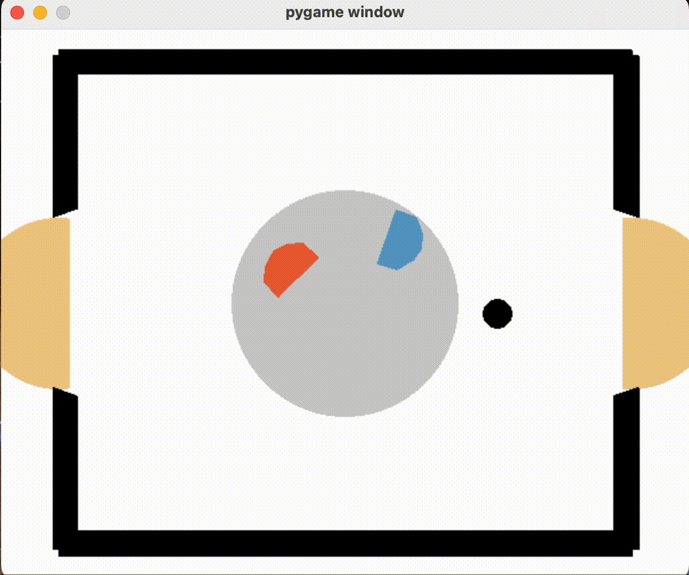

# The Psychedelic Policy Pioneers

This repository contains code to train an agent with [sb3](https://github.com/DLR-RM/stable-baselines3) on the [Hockey Environment](https://github.com/martius-lab/laser-hockey-env). The project was conducted at the University of Tübingen as part of the reinforcement learning lecture in the summer semester of 2023 achieving third place in the tournament.



## Getting started

First install the environment from https://github.com/martius-lab/laser-hockey-env. Then install the requirements from the requirements.txt file.

```
pip install -r requirements.txt
```

There are various config files in the configs folder. Please check them out for more information. The config files are used to train and test the agents. A few example models are included in `example_models/`.

### Test PPO base model

```
python main.py  --config ./configs/test_ppo_base.yaml
```

### Test TD3 base model

```
python main.py  --config ./configs/test_td3_base.yaml
```

### Test Tournament models

```
python main.py  --config ./configs/test_tournament.yaml
```

### Train PPO agent

```
python main.py  --config ./configs/train_ppo.yaml
```

### Train TD3 agent

```
python main.py  --config ./configs/train_td3.yaml
```

### Test your own agents

Change the paths in the config file to the path of the trained agent. Then run

```
python main.py --config ./configs/test.yaml
```

# Authors and acknowledgment

David Hustadt, Cornelius Wiehl
